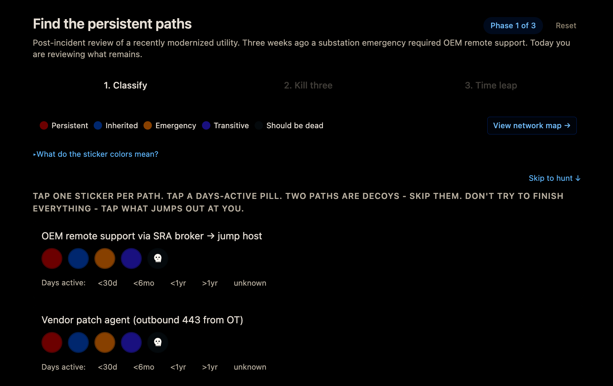

# Find the Persistent Paths

> A 30-minute tabletop micro-lab for ICS / OT security practitioners.

### → <a href="https://tonylturner.github.io/vendor-access-microlab/" target="_blank" rel="noopener">Open the worksheet</a> &nbsp;·&nbsp; <a href="https://tonylturner.github.io/vendor-access-microlab/assets/network_map.svg" target="_blank" rel="noopener">View the network map</a>

Look at a fictional electric distribution utility three weeks after a substation emergency. Identify how vendor remote-access paths quietly become permanent. Confront one of the most underdiscussed problems in operational technology.

> [!IMPORTANT]
> **Vendor access is not temporary.** Every grant becomes permanent the moment it is signed - unless the expiration is built in before the key is turned.

*Phase 1 of the worksheet, shown in dark mode. Classify each vendor access path with a sticker, mark how long it has been active, then hunt the seven hidden risks embedded on the network map. Works equally well on phone or laptop, light or dark mode. Click the image to enlarge.*

 

## At a glance

| | |
|---|---|
| **Duration** | 30 minutes |
| **Audience** | ICS / OT security practitioners |
| **Format** | Digital - attendee phones or laptops + projector |
| **Attendee setup** | None. No app, no account, no downloads. |
| **Instructor setup** | ~20 minutes, once |

## How it runs

The lab moves through three phases. The instructor drives pacing from the projector. Attendees work on their own device.

| Phase | Time | What attendees do |
|---|---|---|
| **1 - Classify** | ~7 min | A network map appears on the projector. Open the worksheet, tap a sticker on each vendor access path, note how long it has been active, and hunt seven hidden risks embedded in the map. |
| **2 - Kill three** | ~7 min | A simulated incident occurs. Pick three access paths to disable under an operational budget. Vote in the projector poll. The room's collective choices appear in real time. |
| **3 - Time leap** | ~10 min | Six months pass. No incident occurs. Look at what you did - and did not - remove. Vote once more. See what the room thinks about its own environment. |

## Learning objectives

By the end of the lab, attendees will be able to:

1. **Recognize** how vendor-access paths accumulate over time and rarely get decommissioned.
2. **Classify** vendor access by lifecycle origin: persistent, inherited, emergency, transitive, or dead.
3. **Identify** high-risk patterns: dual-homed hosts, shared service accounts, outbound-443 patch agents, "TEMP" firewall rules.
4. **Quantify** the operational vs. security tradeoffs of reducing access.
5. **Apply** the framework to their own environment.

The lab's findings map directly to **NERC CIP-013** supply-chain risk controls.

## What you need

> [!NOTE]
> A phone or laptop with a working camera and a web browser. No accounts, no downloads, no app installs.

During the lab, the instructor projects two QR codes:

1. The **worksheet** - a single web page where you work through all three phases.
2. The **live polls** - run in Slido or Mentimeter, where you vote at three key moments.

## Live links

> [!TIP]
> The worksheet is hosted on GitHub Pages and remains functional once loaded - even if Wi-Fi drops mid-lab.

- **Worksheet** - <a href="https://tonylturner.github.io/vendor-access-microlab/" target="_blank" rel="noopener">https://tonylturner.github.io/vendor-access-microlab/</a>
- **Polls** - filled in by your instructor at the start of the lab
- **Network map** - <a href="https://tonylturner.github.io/vendor-access-microlab/assets/network_map.svg" target="_blank" rel="noopener">network_map.svg</a> if you want it on your own device

## About the worksheet

The worksheet saves your work automatically to your browser. If your phone sleeps, your tab closes, or you accidentally refresh, your progress is restored. A small "saved" indicator flashes after each action.

Tap **Reset** in the top-right header to start over.

Phase 1 is open immediately. Phases 2 and 3 wait for the instructor's cue but can be previewed - the lab works best in sequence.

## After the lab

Your browser keeps your final state. Reopen the worksheet URL anytime to revisit what you did. Aggregate room results from the polls are shared by your instructor.

## License

This work is licensed under [**Creative Commons Attribution-NonCommercial 4.0 International**](https://creativecommons.org/licenses/by-nc/4.0/) (CC BY-NC 4.0). See [`LICENSE`](./LICENSE) for full text.

You're welcome to share and adapt this lab for non-commercial use with appropriate credit and a link to the license. For commercial use, contact [tturner@sans.org](mailto:tturner@sans.org).

---

*A SANS ICS Summit workshop on securing vendor access in industrial environments.*
